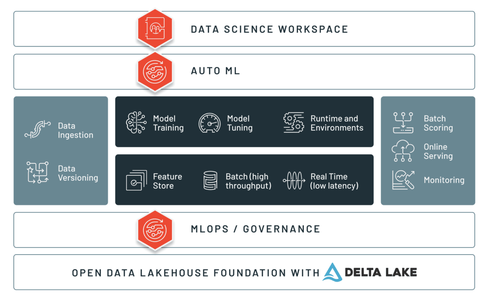
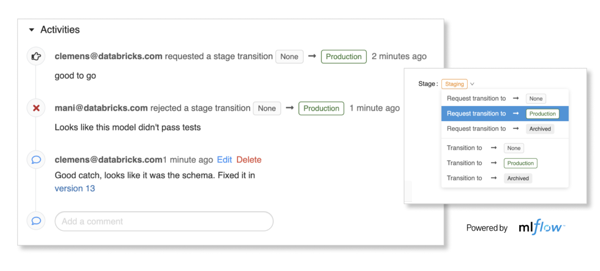
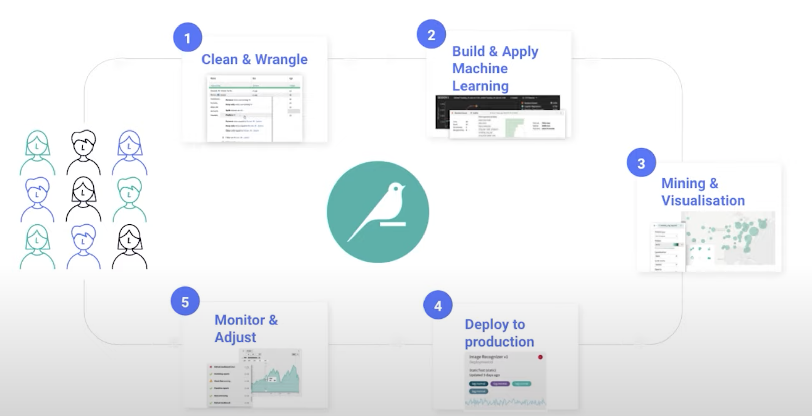
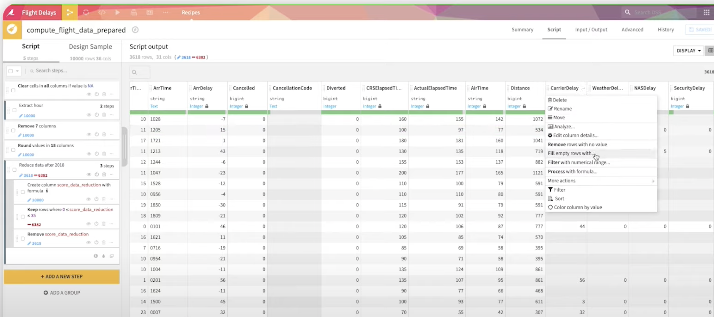
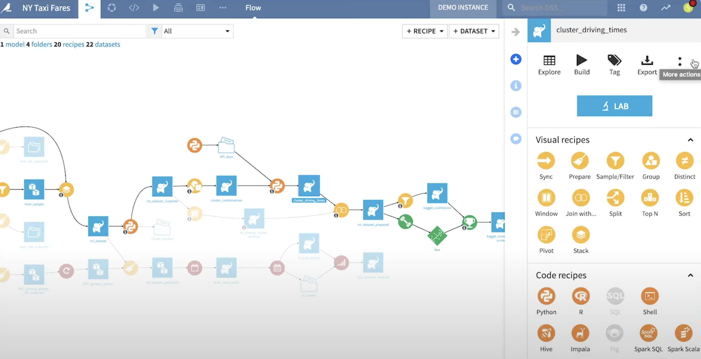

## Databricks, Dataiku, h2o.ai

- [Databricks](#databricks-lakehouse-platform)
- [Dataiku](#dataiku)
- [h2o](#h2oai) 

### Intro

Here we compare two established end-to-end platforms that both have particularly strong features for data preparation and training. They also both have Spark integration and AutoML capabilities. But they&#39;re very different in detail.

Databricks starts from data storage and data engineering and builds out to provide a platform for data engineering, machine learning and analytics. Dataiku&#39;s focus is making data analysis and ML accessible to analysts as well as speeding up ML for data scientists.

### Databricks Lakehouse Platform

The Databricks Lakehouse Platform aims to bring data engineering, machine learning and analytics. One of its selling points is a unified architecture to try to break down silos and encourage collaboration. The platform contains areas that address particular needs, which they break down as:

- Delta Lake (flexible storage with built-in history)
- ETL
- Machine Learning
- Data Science
- Databricks SQL
- Security and Administration

[Delta Lake](https://databricks.com/product/data-science) is the reason why lakehouse gets its name. It&#39;s a format based on Parquet that makes it possible to ACID transactions to a data lake in cloud object storage. This makes it suitable for streaming as well as batch processing. Delta Lake can also enforce a schema, support schema modification and keep a transaction log. So you get a combination of the features of a data lake with those of a data warehouse - hence &#39;lakehouse&#39;.

We will focus primarily on the [Data Science](https://databricks.com/product/data-science) and [Machine Learning](https://databricks.com/product/machine-learning) parts of the platform.

#### Data Science

Delta Lake is [relevant to data scientists](https://databricks.com/discover/demos/machine-learning-with-mlflow) insofar as it helps bring a schema to otherwise schemaless data. This helps to ensure data quality and reduce friction between the data engineering and data science stages.

Databricks notebooks support a range of languages and ways of working with data. You can perform Spark operations, SQL, use python, R and more, all in the same notebook.

Different types of data work will have different compute needs. Databricks supports this with different [types of clusters](https://docs.databricks.com/clusters/index.html), including requests for specialist underlying compute like GPUs.

#### Machine Learning

Prepared features can be stored in the [platform&#39;s feature store](https://docs.databricks.com/applications/machine-learning/preprocess-data/index.html) so that they can be discovered and shared with other teams.

Model training support is integrated with notebooks - [training runs are tracked with mlflow](https://docs.databricks.com/applications/machine-learning/train-model/ml-quickstart.html) and the training job history can be seen from a panel next to the notebook. Trained models can go to the [model registry](https://docs.databricks.com/applications/machine-learning/manage-model-lifecycle/index.html), from which they can be transitioned between environments:

Models can be deployed for [real-time inference/serving](https://docs.databricks.com/applications/machine-learning/model-deploy/index.html). [Batch inference is also supported](https://docs.databricks.com/applications/machine-learning/model-inference/index.html), either on models in a popular framework or using spark mllib. Spark also has support for streaming.

#### AutoML

Databricks offers [AutoML features](https://docs.databricks.com/applications/machine-learning/automl.html) within the context of notebooks. Python code is used to trial different algorithms and models for a dataset. In the background databricks creates notebooks specifically for each of the permutations that it trials, so that you can see what happened under the hood and leverage the code.

### Dataiku

Dataiku&#39;s tagline is &#39;Everyday AI, Extraordinary People&#39;. Its platform emphasises the visual, attempting to make data tasks faster and more accessible. Users are able to explore and clean data using Data Science Studio&#39;s simple visual interface and can also write code for transforming data. Pipelines can be built up visually and transformation steps (&#39;recipes&#39;) can be pre-built drag-and-drop or crafted using a chosen language/tool. Rather than competing with Spark or Hadoop, Dataiku integrates with these and other tools. It also includes features for deployment, monitoring and collaboration.

#### Data Exploration and Transformation

Work in Data Science Studio happens within a project. A project can contain datasets, which can be selected from a wide variety of sources including cloud blob storage, databases, hadoop, spreadsheets, sharepoint, salesforce and social media. This variety is because the platform is designed to be used by a wide range of users. Where possible Data Science Studio keeps the data in its original location and performs the processing at source (e.g. by integrating with Hadoop).

Once the dataset is in the project then it can be explored and manipulated. Data Science Studio infers the data types of columns and can highlight missing values or outliers. There&#39;s an easy, spreadsheet-like interface for applying operations or writing formulas to handle missing values, apply transformations or create new columns:

There are many built-in transformations for different data types and they can be previewed against a small sample of data before applying to the whole set. This kind of interface with the ability to interface to large databases and hadoop has a clear appeal to business-focused data analysts (which is a [key focus for Dataiku](https://www.youtube.com/watch?v=MUwloqMJ8BQ)) and is designed to also save time for those who are [comfortable getting into the code](https://www.youtube.com/watch?v=ryZRRIjQ5Z8).

Within a Data Science Studio you create Flows that correspond to Pipelines in other platforms. Within a Flow you can embed Recipes that transform Datasets. These Recipes can be pre-built, constructed visually (e.g. visual join operations) or written using code:

#### Model Building and Deployment

Data Science Studio provides a [Lab for assisted building of models](https://www.youtube.com/watch?v=cT4lRTNW9ns). Here you can build models using configurable AutoML with many tunable parameters (or you can use the defaults). You can also obtain predictions, explain predictions and output reports.

The Lab is a separate area from a Flow so to build a model within the Flow it needs to be &#39;Deployed&#39; into the Flow. This creates a training Recipe in the Flow and a Model as the output of the Recipe. The Flow could then have a step to generate predictions using the model (a Scoring step) or it could Deploy the model as an API. New runs will then [automatically replace the live version](https://www.youtube.com/watch?v=zWs_B_cVjtc) (with old versions kept as options to roll back to).

Models are not restricted to the AutoML features and can be [written with custom code](https://doc.dataiku.com/dss/latest/machine-learning/algorithms/in-memory-python.html#custom-models) or using [Spark MLLib](https://doc.dataiku.com/dss/latest/machine-learning/algorithms/mllib.html) or [H2O&#39;s Sparkling Water](https://doc.dataiku.com/dss/latest/machine-learning/algorithms/sparkling-water.html). Deploying a model creates an API endpoint. [API endpoints](https://doc.dataiku.com/dss/8.0/apinode/endpoints.html) can also be created for custom code functions or even SQL queries. Data Science Studio can also [host a frontend](https://doc.dataiku.com/dss/8.0/webapps/index.html#introduction-to-dss-webapps) with tools for building your own interactive Webapp or you can instead [publish a simple dashboard](https://doc.dataiku.com/dss/latest/dashboards/index.html).

[Metrics](https://knowledge.dataiku.com/latest/courses/automation/metrics-checks-hands-on.html) can be tracked for Datasets (such as number of records or records in a value range) or for Models (such as ROC AUC). Checks can then be created against these Metrics so that warnings are displayed if the Checks fail.
