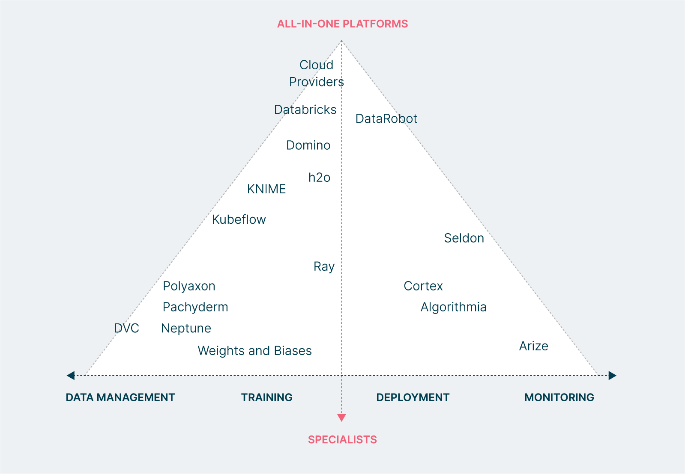
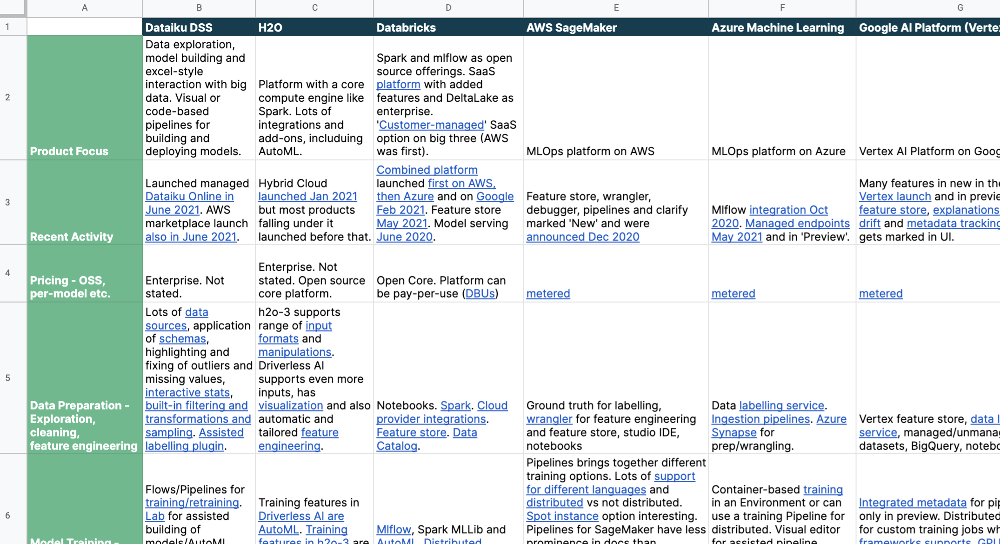

## MLOps Platforms

MLOps is an especially confusing landscape with [hundreds of tools available](https://huyenchip.com/2020/12/30/mlops-v2.html). This project helps to navigate the space of MLOps platforms.

Understanding MLOps platforms is complex. Platforms have their own specializations and there is no clear line between a tool (with a narrow focus) and a platform (which supports many ML lifecycle activities). The below (from [the Thoughtworks Guide to MLOps Platforms](https://www.thoughtworks.com/what-we-do/data-and-ai/cd4ml/guide-to-evaluating-mlops-platforms)) illustrates how some of the platforms specialize in particular areas (bottom) and others aim to cover the whole lifecycle with equal focus (top):

Even platforms that have a similar scope have different concepts and strategies, making them hard to compare directly. This repository provides resources for evaluating MLOps platforms.

If you're wondering what process to use to evaluate MLOps platforms, see the [Thoughtworks Guide](https://www.thoughtworks.com/what-we-do/data-and-ai/cd4ml/guide-to-evaluating-mlops-platforms) and the [webinar recording](https://www.thoughtworks.com/what-we-do/data-and-ai/cd4ml/guide-to-evaluating-mlops-platforms1). If you know how to evaluate MLOps platforms and want materials, read on.

### Comparison Matrix Format

The matrix an open format of categories with links to vendor documentation within cells to highlight features. This lets vendors do things their own ways and helps readers find the detail they need.

### Comparison Matrix

We suggest to click through to the [master spreadsheet in google sheets](https://docs.google.com/spreadsheets/d/1nRqjnD7SCMJGmYR2gdZJ84YolLnHAMJwjSG7z7VcM6c/edit?usp=sharing):

If you can't access or don't like google sheets then there is a [translation of the matrix into Github markdown](markdown_matrix.md)

### Platform Profiles

These profiles are concise marketing-free introductions to key concepts of MLOps platforms. This provides just enough context to make sense of the features in the matrix.

- [AWS Sagemaker](AWS_Google_Azure.md#amazon), [Google Vertex](AWS_Google_Azure.md#google) and [Microsoft Azure ML](AWS_Google_Azure.md#azure)
- [Databricks](Dataiku_Databricks.md#databricks-lakehouse-platform), [Dataiku](Dataiku_Databricks.md#dataiku)
- [h2o](h2o_knime.md#h2oai) and [KNIME](h2o_knime.md#knime)
- [kubeflow](kubeflow_mlflow.md#kubeflow) and [mlflow](kubeflow_mlflow.md#mlflow)

### Contributions

Everyone is welcome to contribute, including vendors. Language should be neutral - marketing language will not be accepted.

Changes are welcome by PR or issues - please create a copy of the spreadsheet, link to or upload your copy and explain which parts are changed. Please follow the existing format or raise an issue in advance to suggest changes to the format. On approval a maintainer will then update the [master spreadsheet](https://docs.google.com/spreadsheets/d/1nRqjnD7SCMJGmYR2gdZJ84YolLnHAMJwjSG7z7VcM6c/edit?usp=sharing) used to [generate the markdown](https://tabletomarkdown.com/convert-spreadsheet-to-markdown/).

### Disclaimer

We do our best to keep this information accurate and up-to-date but cannot provide guarantees. References to documentation are provided throughout so readers can check for themselves. If you spot anything inaccurate then please raise an issue or pull request (see [Contributing section](#contributions)).
