## h2o.ai, KNIME

- [h2o](#h2oai) 
- [KNIME](#knime)

### Intro

Here we profile two platforms that are each end-to-end and each take their own particular view of the model building process and data science experience. 

H2O started as an open source Java-based engine for running machine learning algorithms. It is now a suite of tools consolidated into h2o.ai hybrid cloud. KNIME Analytics Platform offers a visual, low-code way to do data science and data analysis tasks. The open source KNIME Analytics Platform is supplemented with KNIME Server, which adds hosting, collaboration and monitoring capabilities for enterprise.


### H2o.ai

H2o.ai provides a range of products. We&#39;ll go over the key ones and how they relate to each other. Let&#39;s start with the open source product &#39;h2o&#39;, which is the oldest one and shares its name with the company. The latest version is called h2o-3 (which also helps separate the product from the company names).

#### H2o-3

H2o-3 comes with a UI called Flow. Within Flow you get a notebook-like environment for working with data and building models. Cells can be written with code or you can use a wizard-like interface to choose steps like [loading a file or imputing missing values](https://docs.h2o.ai/h2o/latest-stable/h2o-docs/data-munging.html) (which results in some [CoffeeScript going into the cell for us](https://towardsdatascience.com/getting-started-with-h2o-using-flow-b560b5d969b8)). Models can be trained [using built-in algorithms](https://docs.h2o.ai/h2o/latest-stable/h2o-docs/data-science.html).

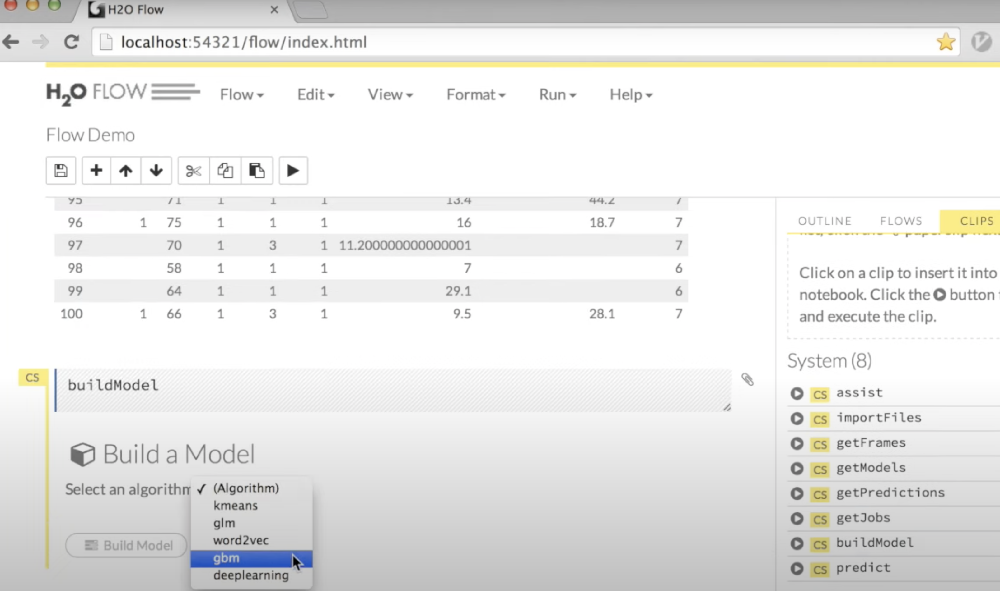

The execution behind all this is an in-memory compute engine running in the Java Virtual Machine but you [can work with](https://docs.h2o.ai/h2o/latest-stable/h2o-docs/quick-start-videos.html#quick-start-videos) Python or R as well as CoffeeScript and can interface to Hadoop or Spark. Models can be [exported](https://towardsdatascience.com/getting-started-with-h2o-using-flow-b560b5d969b8) to run in other Java environments (e.g. [a Spring Boot app](https://aws.amazon.com/blogs/machine-learning/training-and-serving-h2o-models-using-amazon-sagemaker/)) or [outside of Java with the provided runtime libraries](https://www.h2o.ai/products/h2o-driverless-ai/mojo-deployment-options/).

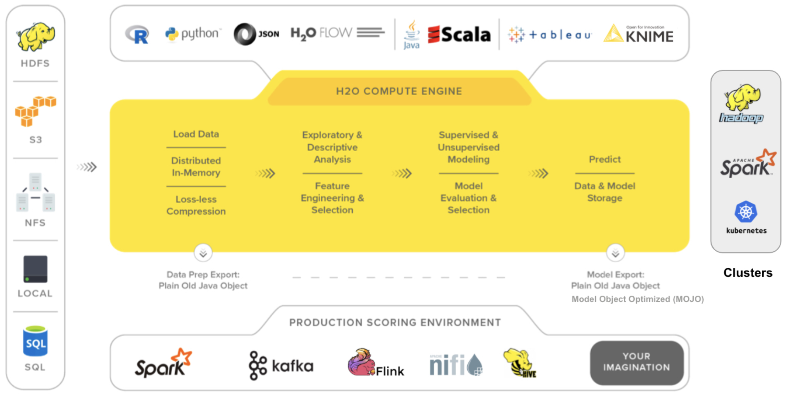

#### Sparkling Water

This is [h2o-3 but on top of Spark](https://docs.h2o.ai/#sparkling-water). So you can [run h2o algorithms on Spark](https://docs.h2o.ai/sparkling-water/3.1/latest-stable/doc/about.html).

#### Steam

Steam is for [managing h2o jobs on top of Spark or Kubernetes](https://www.h2o.ai/enterprise-support/#enterprise-security).

#### Driverless AI

Where h2o-3 gives you assistance in building models, Driverless AI is an alternative approach that is full-on AutoML. With h2o-3 you pick the algorithm but with Driverless AI a range of algorithms get tried out for you to pick the best.

You start with data representing historical observations with outcomes. You connect Driverless AI to your data (it supports a range of sources) and it then lets you explore the data and visualize column stats/correlations. It does test-train split and lets you set some options before running experiments. It automatically evaluates a range of different algorithms and compositions of features:

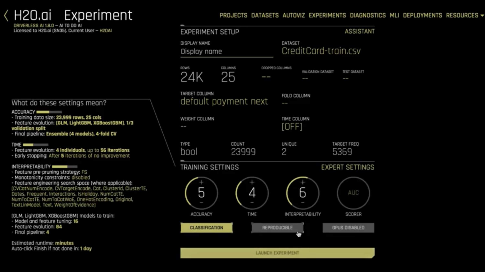

Driverless AI takes the approach of offering defaults and letting more advanced users drill into the details of how the experiments are conducted. It then provides insights into the model created and which features are most important for which predictions (explationations). Models can be exported to be run in a range of environments, much like h2o-3 models.

#### MLOps

[H2o MLOps](https://docs.h2o.ai/mlops-release/latest-stable/docs/userguide/index.html) is a model deployment and monitoring suite that runs on kubernetes. It handles models built with h2o-3 or h2o Driverless AI or you can Bring Your Own Model (provided you [specify a detailed schema for it](https://docs.h2o.ai/mlops-release/latest-stable/docs/userguide/byom.html#mlops-byom)).

#### Wave

[Wave](https://www.h2o.ai/products/h2o-wave/) is for developing ML-enabled and data-focused applications in python. Developers use python to write the UI as well as the backend and the data-handling. This makes it easy to embed graphs and charts.

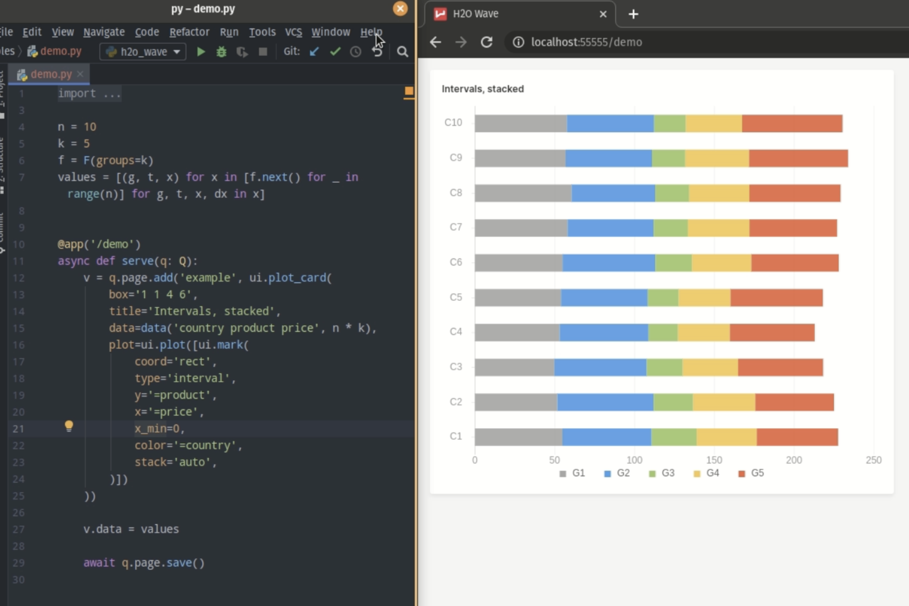

#### Hybrid Cloud Platform

[H2o Hybrid Cloud Platform](https://docs.h2o.ai/h2o-ai-cloud/index.html) brings together other h2o products to provide an integrated setup for developing, deploying, hosting and sharing applications. It runs on kubernetes so it can be installed on public, private or hybrid clouds.

The public face of the platform is the [Appstore](https://docs.h2o.ai/h2o-ai-cloud/docs/userguide/basic-concepts). This shows a set of tiles for published apps built with Wave. The platform allows apps built with Wave to be operationalised and published to the Appstore. [Driverless AI and h2o-3 projects can also be leveraged](https://www.h2o.ai/hybrid-cloud/request-demo/). The Driverless AI projects are automatically available in the MLOps screens in the platform. Deployed models can be leveraged by apps built with Wave.

Deployed models can be monitored using the features from the MLOps product. Steam is also integrated for managing h2o jobs.


### KNIME

KNIME Analytics Platform is a free, open source visual development environment for data science. The Platform is used to build workflows which can then be deployed for production usage with KNIME Server, which is a paid enterprise offering. The KNIME approach to data science is unusual when compared to other MLOps platforms. It is better to think of KNIME as a platform for data science and analytics and to think of its MLOps capabilities as complementing its approach to data science.

#### KNIME Analytics Platform

##### Understanding Workflows

KNIME Analytics Platform is a codeless environment for building data science, data analysis and data manipulation workflows. Let&#39;s think about why one might want to take a low-code approach to data science. Consider this block of python code that trains a random forest classifier:

```python
# Importing the libraries
import numpy as np
import matplotlib.pyplot as plt
import pandas as pd

# Importing the dataset
dataset = pd.read_csv('Social_Network_Ads.csv')
X = dataset.iloc[:, [2, 3]].values
y = dataset.iloc[:, 4].values

# Splitting the dataset into the Training set and Test set
from sklearn.cross_validation import train_test_split
X_train, X_test, y_train, y_test = train_test_split(X, y, test_size = 0.25, random_state = 0)

# Feature Scaling
from sklearn.preprocessing import StandardScaler
sc = StandardScaler()
X_train = sc.fit_transform(X_train)
X_test = sc.transform(X_test)

# Fitting Random Forest Classification to the Training set
from sklearn.ensemble import RandomForestClassifier
classifier = RandomForestClassifier(n_estimators = 10, criterion = 'entropy', random_state = 0)
classifier.fit(X_train, y_train)

# Predicting the Test set results
y_pred = classifier.predict(X_test)
```

Notice that there&#39;s very little control flow - no for loops or if statements. Instead the code calls operations from libraries to manipulate data and create a model. Much space is devoted to setting configuration options on the libraries for operations.

Given that we essentially have a sequence of operations in a workflow, why not handle this visually? Each operation can be a node. If the platform supports the operations, then we can configure the operations in the nodes in the platform and not deal with code or the nuances of libraries. The above code is very much like [this KNIME workflow](https://hub.knime.com/raksharawat/spaces/Public/latest/project/9.%20Random%20Forest%20Regression~6dkpKR7RShJyNV9d):

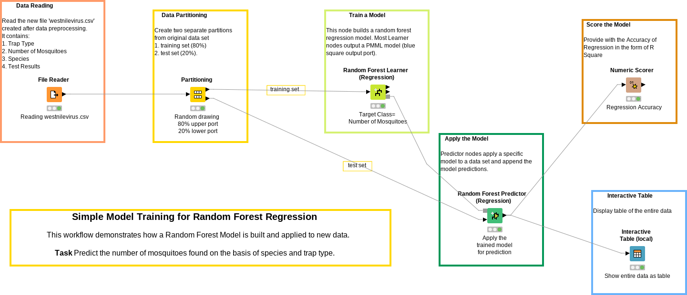

Workflows generally have lots of text and boxes on them. These are annotations - they&#39;re not functional. They&#39;re comments. It&#39;s just the icon-like boxes that capture operations - these are the nodes.

You compose workflows by dragging and dropping nodes onto a canvas from the node repository. You then configure exactly what each node does. The configuration is a pop-up for each node and may not show in the diagram but is part of the saved workflow. In the above we start with a File Reader node that loads a CSV file, the data set is then passed on a Partitioning node and the training set goes on to train a Random Forest model. You draw and configure these workflows in the [KNIME Analytics Platform workbench](https://docs.knime.com/2019-06/analytics_platform_workbench_guide/index.html#the-knime-workbench), which is a desktop application:

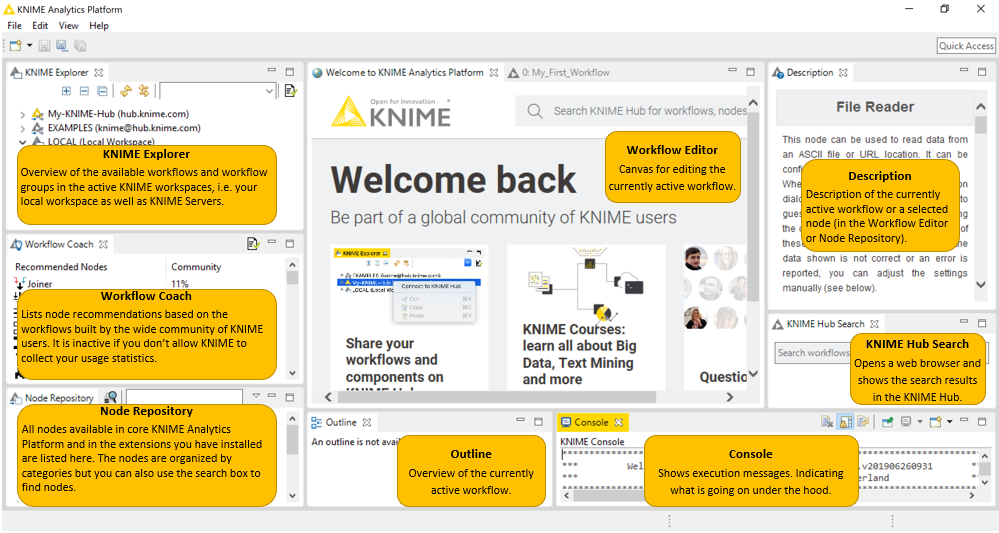

Workflows live in the top-left. There&#39;s a canvas in the middle and nodes can be dropped onto the canvas from the bottom-left. The console at the bottom right is for debugging as workflows can also be executed from within the workbench.

Let&#39;s now understand more about how KNIME workflows work.

##### Nodes and Ports

Nodes are connected through ports. The most common ports are data ports [handling tabular data](https://docs.knime.com/2018-12/analytics_platform_workbench_guide/index.html#data-table). Many reader nodes like the CSV reader output data as data tables. As you&#39;d expect, this is a type that contains columns and rows and columns can be of the [usual types](https://docs.knime.com/2018-12/analytics_platform_workbench_guide/index.html#data-table). Nodes that output tables typically write them to disk and there&#39;s a KNIME file format for data tables ([.table](https://hub.knime.com/knime/spaces/Examples/latest/01_Data_Access/01_Common_Type_Files/06_Table_Reader~ua4RudFCVylfMOzF)). Output can also be seen in the workbench. The workbench makes it easy to explore data has integrations to help see how the data flows through the workflow - for example, when you hover over a data port then it displays the format of the data ([number of rows and columns](https://forum.knime.com/t/when-component-ports-reordered-reorder-ports-in-component-description-too/27062)):

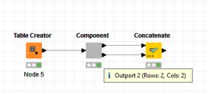

It&#39;s not only tabular data that flows between nodes. An output could be an image or a ML model (which can be written as [PMML](https://forum.knime.com/t/exporting-machine-learning-models/20831) but doesn&#39;t have to be written out beyond being a node in the workflow). There are also flow variables, which might be reference values used in calculations.

##### Do I Really Not Need Code?

There are many, many nodes available and the community contributes to keep this growing. There are [integrations available to frameworks such as keras](https://www.knime.com/deeplearning/keras) so that you can compose a keras-based deep learning architecture that you can see visually and without having to write python code.

You can dive into code in KNIME with script nodes. For example, there&#39;s a [python script node](https://hub.knime.com/knime/extensions/org.knime.features.python2/latest/org.knime.python2.nodes.script2.Python2ScriptNodeFactory2) that can receive input data as pandas data frames. There are also integrations for [Java](https://hub.knime.com/knime/spaces/Examples/latest/07_Scripting/01_Java/01_Example_of_Java_Snippet~-L6cZ5ZEx93PIU7G) and [R](https://hub.knime.com/knime/spaces/Examples/latest/07_Scripting/02_R/01_Example_of_R_Snippet~lc8PFcTAmnlC2rsE). There&#39;s also an option to code up your [own nodes](https://www.knime.com/first-steps-on-how-to-create-your-own-node) and components ([which bundle the functionality of multiple nodes](https://docs.knime.com/2020-07/analytics_platform_components_guide/index.html#introduction)). For steps that use dependencies, there&#39;s a [conda environment propagation node](https://www.knime.com/blog/how-to-manage-python-environments-conda-and-knime), which avoids having to preinstall the right libraries before you can run a workflow.

##### Visualizations

KNIME workflows are not limited to processing of data - they can also feature points of display and interaction. Some [nodes perform plots](https://hub.knime.com/knime/spaces/Examples/latest/03_Visualization/02_JavaScript/12_Bivariate_Visual_Exploration_with_Scatter_Plot~by7OzxDGdOReyi_0) and graphs that are displayed to the user in the workbench when the workflow is run. There are javascript-enabled nodes that can do things like [hovers](https://forum.knime.com/t/scatter-plot-with-samples-name/19304/2):

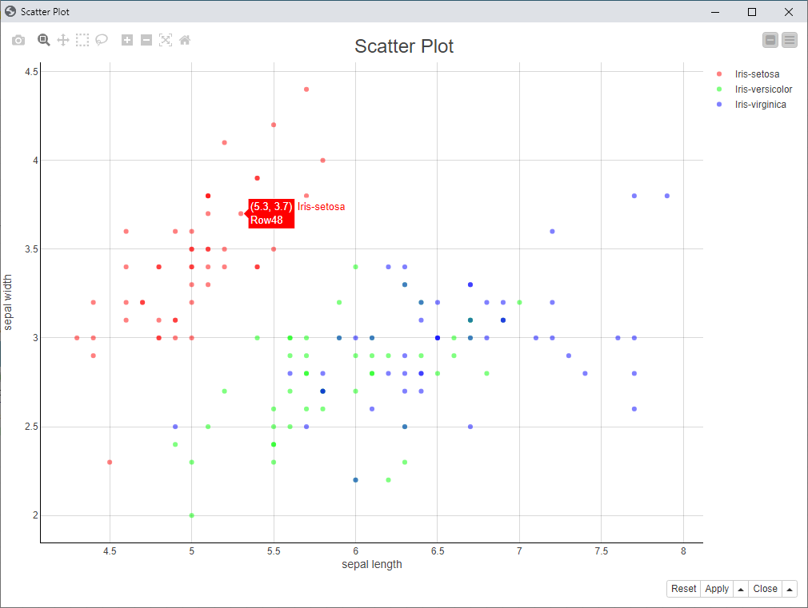

You can also combine javascript-based nodes to make components [involving multiple related plots](https://docs.knime.com/2020-07/analytics_platform_components_guide/index.html#img-JSON-format-view) of the same data.

Components offering views of data can become hosted web pages with [KNIME Server&#39;s WebPortal](https://www.knime.com/knime-software/knime-webportal). Then they can be used outside of KNIME&#39;s workbench. We&#39;ll understand this better when we cover KNIME Server.

##### Local vs Hosted Working and File Handling

Everything we&#39;ve discussed about reading and writing files so far has probably suggested files loaded from paths on the local machine. KNIME was originally designed for a local machine working environment and significant changes were made to [support more cloud-hosted files](https://docs.knime.com/latest/analytics_platform_file_handling_guide/index.html#introduction). Now there&#39;s a concept of a [dynamic port](https://docs.knime.com/latest/analytics_platform_file_handling_guide/index.html#old-new-nodes-distinguish), which is basically a data port that is decoupled from the file system. These allow KNIME to work with files in different types of file systems and file hosting, including cloud storage buckets. Files can also be parameters so that they&#39;re specified by the user on execution.

#### KNIME Server

KNIME server can be thought of as a hosting platform for workflows. KNIME Server can run on a different machine from installs of the Analytics Platform. Each member of a team would have their own install of the Analytics Platform but there might only be one KNIME Server. The Server has [executors/workers to do the work of executing workflows](https://www.knime.com/elastic-hybrid-execution). Executors can be run in elastic cloud-based infrastructure or on premise.

In addition to running workflows, KNIME Server also hosts workflow artefacts. So it can be used as a kind of repository as well as a hosting platform.

##### Deploying Workflows with KNIME Server

What gets deployed to KNIME server is not simply a model. It is a workflow. To understand this, let&#39;s consider an example workflow:

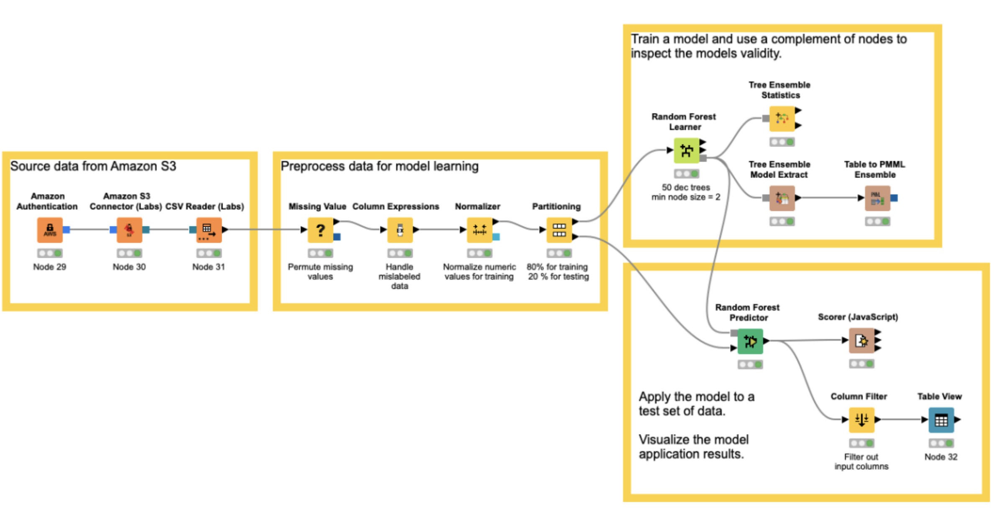

This example is drawn from Jim Falgout&#39;s contribution to the whitepaper &#39;[MLOps: Continuous Delivery for Machine Learning on AWS](https://d1.awsstatic.com/whitepapers/mlops-continuous-delivery-machine-learning-on-aws.pdf)&#39;. We source data from S3, preprocess that data, train a model and use the withheld test data to make predictions. We then get a visual of performance on the test data.

When deploying this, we probably don&#39;t want that visual of performance on the test data. We also don&#39;t want to go through the training steps each time that a REST call is made to get a prediction. But we may want to perform some of the same pre-processing steps that we did during training, since if we had to do that on the training data then we&#39;ll likely have to do it on the live data too.

For this KNIME lets you specify parts of the workflow that should be used in the KNIME server workflow. Here for example is the workflow we discussed previously, now with parts specified for the deployment workflow:

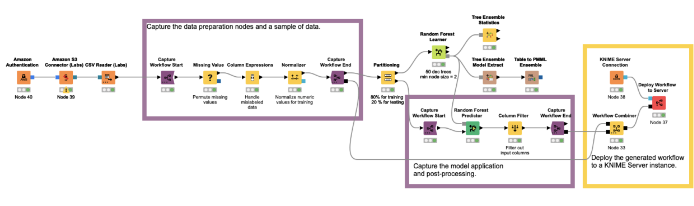

The purple &#39;Capture Workflow Start&#39; and &#39;Capture Workflow End&#39; nodes show the start and end of sections to be captured. These parts of the workflow are saved and stitched together in the background and the resulting workflow is [deployed to KNIME server using the step at the end](https://www.knime.com/integrated-deployment). The generated workflow that is deployed looks like this:

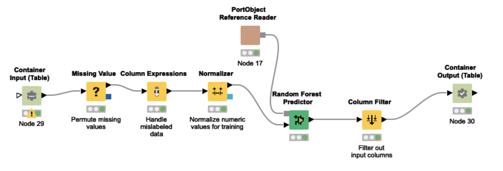

Notice this is the amalgamation of the two purple &#39;Capture Workflow&#39; sections above. The beginning and end of the workflow are container nodes. These are placeholders for input and output, which in live execution will be via REST. So a REST call&#39;s payload will go through the transformations in yellow before going into the model and then via the filter before the output is returned via the output container node. Note that in the previous workflow there was a random forest learner feeding into the random forest predictor. Here simply go straight into the predictor - effectively we&#39;ve already trained the model and it is simply being used to make predictions in the deployed workflow.

The deployment step does not have to be invoked from within a KNIME workflow in the Analytics Platform. It&#39;s also possible to export the generated workflow above e.g. to an S3 bucket. This write could trigger a CI pipeline that deploys to KNIME Server. There could be tests run in KNIME server to [validate the workflow for production](https://forum.knime.com/t/how-do-you-use-knime-testing-framework-on-knime-server-no-readmes-out-there-yet/33096/6).

##### Monitoring

You may not simply want to deploy the model without checking that it performs as well as the model it is taking over from. And you may want to monitor performance over time and trigger retraining if performance drops. These performance-based rollouts and on-going monitoring activities supported in KNIME with the [KNIME Model Process Factory](https://www.knime.com/blog/the-knime-model-process-factory). The idea is basically to add orchestration workflows which can call out to other workflows. The Process Factory contains templates for this - for details the reader is best to consult the [official KNIME white paper on the subject](https://www.knime.com/sites/default/files/inline-images/Model_Process_Management_20170404_1.pdf).

If you&#39;re looking to check model performance for drift or retraining, there&#39;s a [built-in model monitoring node for classifiers](https://www.knime.com/blog/model-monitoring-in-data-science-context).

There&#39;s also monitoring at the platform/executor level, as well monitoring that you build for individual models. KNIME Server can send notification emails for[job success or failure](https://www.knime.com/knime-server-course/chapter2)(KNIME Server can execute scheduled workflows as well as hosting for REST calls) and has a management portal where the [status of running workflows can be inspected](https://youtu.be/NuEhV7TXh1Y?list=PLz3mQ6OlTI0YGAeCMxua_sDWB9Q3quZox&amp;t=481).

##### Web Portal

We&#39;ve seen that you can deploy workflows and make parts of workflows available for REST calls. You can also deploy workflows that contain javascript nodes. This feature of KNIME Server is called [Web Portal](https://www.knime.com/knime-software/knime-webportal). It lets you deploy interactive reports as web applications so that users can interact with these reports without needing KNIME Analytics Platform.

So we&#39;ve seen that nodes can specify interactive reports based on data and that data inputs can be parameterised so that they come from the user when running. Given that this interaction around workflows can be applied to the serving of predictions from models, could it also be applied to building models themselves? This idea is the basis of what KNIME calls &#39;[Guided Analytics](https://www.knime.com/blog/principles-of-guided-analytics)&#39;. You can embed points of interaction in workflows so that users can choose what data to upload in order to retrain the model. This allows for something a bit like AutoML in KNIME. You can deploy workflows where users interactively upload data and the workflow builds models and the user chooses which is best. It is called &#39;Guided Analytics&#39; as the approach is applicable to lots of data analysis and reporting workflows that might not involve any machine learning.

##### Collaboration Features

KNIME Server can host workflows and groups of workflows. You can think of this as a folder structure for collaboration like a shared drive. KNIME Analytics Platform can be connected to a KNIME server and then the hosted workflows and workflow groups become visible from its explorer, provided you [have permission](https://www.knime.com/knime-server-course/chapter1). You can also then choose to deploy workflows to that KNIME Server instance.

The interface in the explorer allows for exploring workflows like a shared drive but KNIME Server&#39;s hosting is as much like git as a shared drive. It has a version history and the ability to [compare versions](https://www.knime.com/knime-server-course/chapter3) as well as permissions with [owners and delegation of rights](https://www.knime.com/knime-server-course/chapter1).
