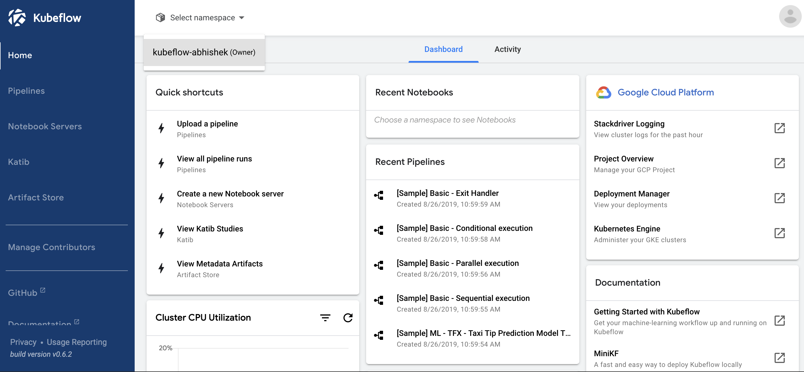
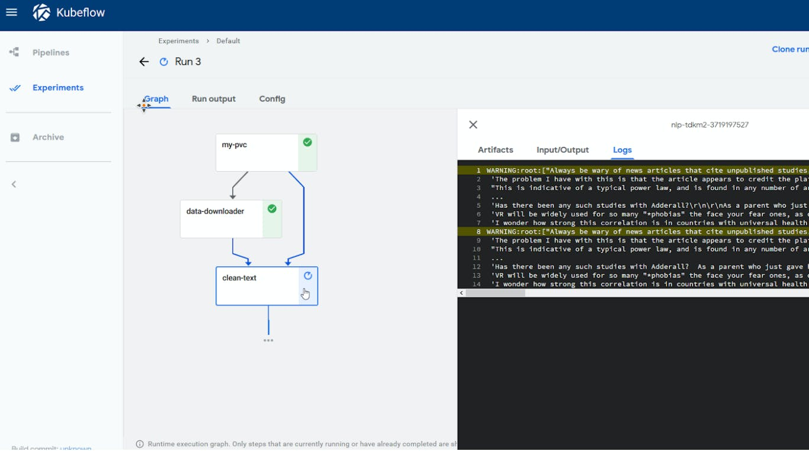
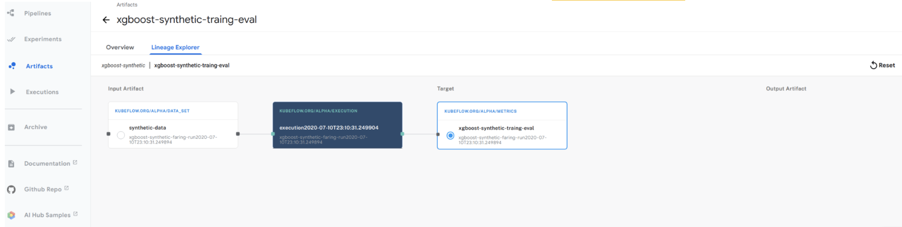
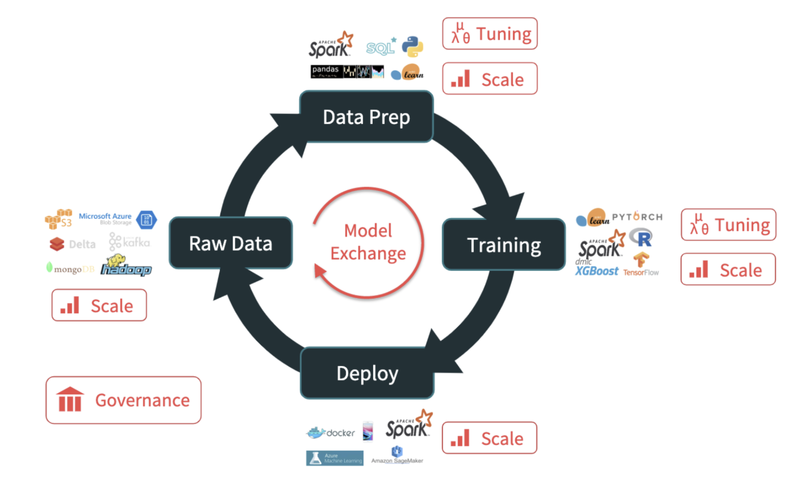
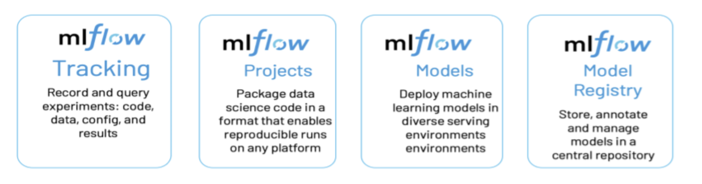
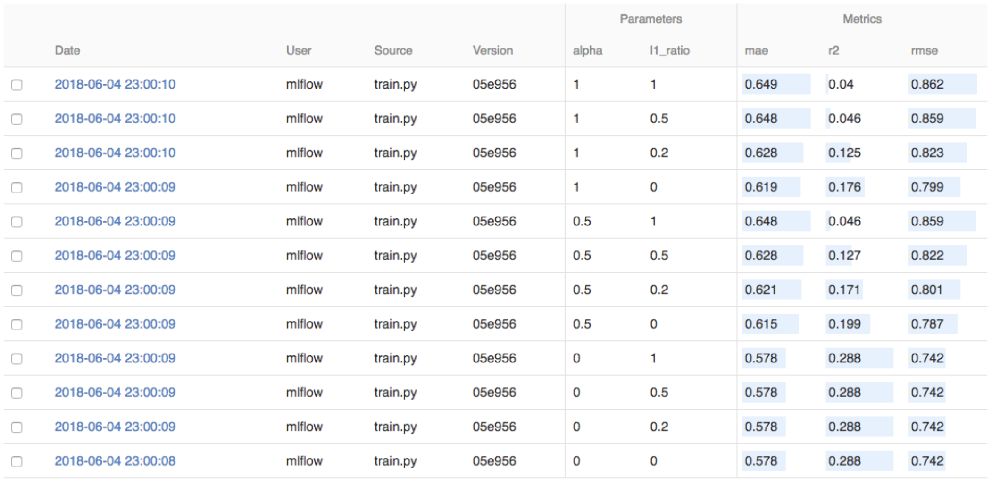
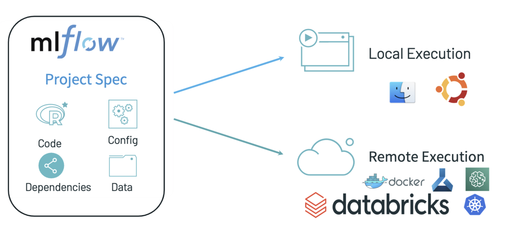
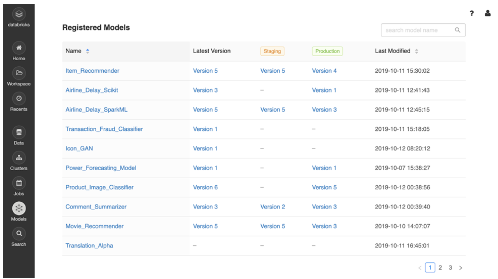

## Kubeflow and mlflow

- [kubeflow](#kubeflow)
- [mlflow](#mlflow)

### Intro

There are many tools in the open source MLOps scene and some companies are putting together their own [assembled](https://www.oreilly.com/radar/why-best-of-breed-is-a-better-choice-than-all-in-one-platforms-for-data-science/) or homegrown platforms. Here we look at two ready-made open source platforms that cover much or all of the lifecycle and [currently seem to be most popular](https://www.oreilly.com/radar/ai-adoption-in-the-enterprise-2021/). Kubeflow is a google-backed MLOps platform for kubernetes. Mlflow is backed by databricks. There are paid-for managed versions of each available but we will focus on the features and direction of the open source versions.

Kubeflow and mlflow take quite different approaches. Some have [even proposed](https://medium.com/geekculture/enhancing-kubeflow-with-mlflow-8983373d0cac) to use the two together. Kubeflow provides components that run on kubernetes, so it has a hosted environment at its heart. Mlflow starts from a local development experience and provides ways to package the local project to make it portable to a range of hosted environments.

### Kubeflow

When kubeflow was first launched it was designed to be [composable, scalable and portable](https://kubernetes.io/blog/2017/12/introducing-kubeflow-composable/):

- Composable: you can pick and choose which parts to use.
- Scalable: your projects can use more or less resources as needed and leverage kubernetes features for scalability.
- Portable: you can use it on different clouds and infrastructure (including on-prem and hybrid cloud).

Kubeflow is designed for kubernetes so it aims to make the benefits of kubernetes available to machine learning. ML workloads with kubeflow run in containers and kubernetes will manage keeping these containers up. Kubernetes itself is cloud-agnostic so kubeflow gets portability from this. Kubeflow has further portability because there are different [distributions](https://www.kubeflow.org/docs/distributions/) of kubeflow for integrating to different clouds. These different distributions leverage kubeflow&#39;s composability by plugging in cloud-specific features in place of some of the kubeflow vanilla ones.

#### Kubeflow Overview


The yellow/orange boxes on the top are supported ML tools (scikit-learn, PyTorch, Jupyter etc.). The darker blue and green boxes at the bottom represent the infrastructure with kubernetes as the base platform and deployment available for different cloud providers or on-prem or local with minikube (there&#39;s also some local interactions with an SDK).

The darker blue box on the middle left shows components. A lot of these are training operators - they may take up a lot of space but they&#39;re not the most important part of kubeflow. When we discuss the components we&#39;ll explain these but we&#39;ll put most emphasis on the kubeflow UI, pipelines, metadata and KFServing. The lighter boxes on the far right are external components - some parts that kubeflow relies on but doesn&#39;t expose to the user (argo, istio) and others that can be optionally used with kubeflow. We&#39;ll see though that there&#39;s not a hard line between [optional add-ons](https://www.kubeflow.org/docs/external-add-ons/) and core components.

#### Components

##### Kubeflow UI (Central Dashboard)

Before you can get into the kubeflow UI, you [first register a user](https://www.kubeflow.org/docs/components/multi-tenancy/getting-started/). Your user will have one or more profiles and with its primary profile it will own a kubernetes namespace. This provides a grouping for notebooks and other kubeflow resources and the kubernetes workloads underlying them (kubernetes resources can be restricted at a namespace level). Once into the UI, you can select namespaces that you have access to:



The UI provides a route to navigate between key resources such as notebooks and pipelines. The exact sections that appear in the UI is [customizable](https://www.kubeflow.org/docs/components/central-dash/customizing-menu/) and some parts will appear different for different [distributions](https://www.kubeflow.org/docs/distributions/) of kubeflow.

##### Pipelines

Kubeflow pipelines provide a way to run ML pre-processing, training and deployment steps within a continuous workflow. Each step can be a separate container that will be scheduled by kubernetes when its resource requirements can be met. Long-running jobs can be executed with access to the resources they need with steps running in parallel and using conditional logic. Multiple pipelines can also be executed in parallel with different values for their parameters.



Each step in a pipeline is implemented as an operation in python code using the Kubeflow Pipelines DSL. Components can be written to be reusable across different pipeline implementations. The finished pipeline python code is compiled to kubernetes tarball of kubernetes yaml by the pipelines sdk (specifically kubernetes yaml that uses the argo orchestration tool). The tarball is then uploaded to the pipelines server component running in the cluster and from there runs can be scheduled by specifying different parameters for the pipelines.

##### Metadata

Kubeflow [metadata](https://blog.kubeflow.org/jupyter/2020/10/01/lineage.html) provides an SDK for logging metadata about artifacts, executions and datasets. This is then logged in the kubeflow setup this is logged in the kubeflow metadata store and can be seen under the &#39;Artifacts&#39; [tab](https://blog.kubeflow.org/jupyter/2020/10/01/lineage.html) in the UI:



There are different distributions for kubeflow to integrate to cloud-specific features. On the Azure distribution the metadata storage can be [replaced with an Azure mysql database](https://www.kubeflow.org/docs/distributions/azure/azuremysql/) and [for AWS an amazon mysql can be used](https://www.kubeflow.org/docs/distributions/aws/customizing-aws/rds/).

##### Notebooks

There&#39;s a hosted [jupyter notebook](https://www.kubeflow.org/docs/components/notebooks/why-use-jupyter-notebook/) installation in kubeflow. These notebooks are hosted in kubernetes and can be [shared between users](https://www.kubeflow.org/docs/components/multi-tenancy/getting-started/#managing-contributors-through-the-kubeflow-ui). Code in notebooks also has easy access to other kubeflow components such as metadata, training or serving.

##### Serving

The primary serving component in kubeflow is now [KFServing](https://www.kubeflow.org/docs/components/kfserving/kfserving/) (but [seldon is packaged in many distributions](https://github.com/kubeflow/manifests/search?q=seldon) and [other serving add-ons are available](https://www.kubeflow.org/docs/external-add-ons/serving/)). It is designed for use on top of a bundled knative, which allows it to scale up and down the amount of resource allocated to deployments based on the traffic they receive. There&#39;s [an integrated UI](https://www.kubeflow.org/docs/components/kfserving/webapp/) to see which models are being served and some basic monitoring.

##### Katib

[Katib](https://www.kubeflow.org/docs/components/katib/overview/) saves data scientists time and effort by searching different sets of parameters and recording the results to see which results in the best models. It is most used for hyperparameter tuning and supports a range of AutoML algorithms aimed at data scientists.

##### Training Operators

A [training operator](https://www.kubeflow.org/docs/components/training/) is a kubernetes custom resource that can be submitted to the cluster and it will run a hosted training job to create a machine learning model. Jobs can be split across multiple containers for distributed training. There are specific operators per ML framework. Kubeflow pipelines can also be used to train models but pipelines as a tool is at the orchestration level and can include steps other than training (including data prep and deployment). A kubeflow pipeline could use a training operator as a step. Or it could train models without using a training operator. You may also choose to train a model with an operator and not use a pipeline.

##### Other Components

Kubeflow has some other notable components that are more on the fringes. [Fairing](https://www.kubeflow.org/docs/external-add-ons/fairing/fairing-overview/), for example, makes it easy to write just a small amount of code to train a model and also have it deployed to the kubernetes cluster. This seems to have become a less popular feature over time. The [FEAST feature store](https://www.kubeflow.org/docs/external-add-ons/feature-store/getting-started/) can be installed with kubeflow but the integration is not yet very deep (the best integration right now is [with KFServing](https://github.com/kubeflow/kfserving/tree/master/docs/samples/v1beta1/transformer/feast)). There&#39;s also [Kale](https://www.kubeflow.org/docs/external-add-ons/kale/), which can translate jupyter notebooks into kubeflow pipelines.

#### Distributions

Kubeflow is available as a vanilla install to just use the native features of kubernetes. But the [preferred route is distributions](https://www.kubeflow.org/docs/started/installing-kubeflow/), which are specific to clouds and providers. These distributions hook into the functionality of specific hosting environments. For example, the AWS distribution can hook into other AWS functionality. This can open up further integrations and reduce infrastructure management time.

### Mlflow

Mlflow takes tracking, reproducibility and portability as its key problems to solve. Rather than provide a hosted solution with components to address each concern, mlflow instead caters to the local experience and the range of options users might choose for hosting. Rather than bake a set of supported libraries and algorithms into the flow, mlflow emphasises portability by adding minimal standardization to project structure and capturing projects as docker-based or conda-based environments.

The below picture of the ML lifecycle (from [a talk by Jules Damji, Databricks](https://databricks.com/discover/managing-machine-learning-lifecycle/mlflow-projects-and-models)) helps to show how mlflow tackles key problems:



At each stage of the lifecycle we see that users want to work with a range of very different tools. Users also want to work locally and then employ different tools in order to scale their work (e.g. training with a small slice of data locally and then a larger slice on a hosted environment to run a longer job). Mlflow therefore makes life cycle transitions and local-to-hosted transitions smoother by providing a standard framework of interaction and an exchange format so that artifacts are portable.

We can get a good feel of mlflow by walking through its key concepts ([diagram by databricks](https://databricks.com/blog/2021/02/03/ray-mlflow-taking-distributed-machine-learning-applications-to-production.html)):




#### Tracking

The tracking features of mlflow are for recording what experiments have taken place. It enables experiment runs to be stored along with all the parameters for each experiment and which models were produced. This can then be searched and referred back to, either by the original author or by others in the team. To use this feature some tracking code is added to the model training code:

```python
   with mlflow.start_run():
        lr = ElasticNet(alpha=alpha, l1_ratio=l1_ratio, random_state=42)
        lr.fit(train_x, train_y)

        predicted_qualities = lr.predict(test_x)

        (rmse, mae, r2) = eval_metrics(test_y, predicted_qualities)

        mlflow.log_param("alpha", alpha)
        mlflow.log_param("l1_ratio", l1_ratio)
        mlflow.log_metric("rmse", rmse)
        mlflow.log_metric("r2", r2)
        mlflow.log_metric("mae", mae)
```

The above is using the python API (there&#39;s also R, Java and REST APIs) and comes from an [official mlflow example](https://www.mlflow.org/docs/latest/tutorials-and-examples/tutorial.html). By default the run parameters and metrics will be logged to a [local directory](https://www.mlflow.org/docs/latest/tracking.html#where-runs-are-recorded). When you then run the command `mlflow ui` using the CLI then you can access the [history of this experiment](https://www.mlflow.org/docs/latest/tutorials-and-examples/tutorial.html) (among other things):



[Artifacts](https://www.mlflow.org/docs/latest/tracking.html#id23) can be recorded as well as parameters and artifacts can then be downloaded from the UI. The storage of run data can be [remote instead of local](https://www.mlflow.org/docs/latest/tracking.html#scenario-4-mlflow-with-remote-tracking-server-backend-and-artifact-stores), to support sharing run info between data scientists. There&#39;s also features to [visualize/graph metrics](https://www.mlflow.org/docs/latest/tracking.html#id57) and a [new feature](https://www.mlflow.org/docs/latest/tracking.html#automatic-logging) to replace all the logging/tracking code with just `mlflow.autolog()` for specific machine learning frameworks.

#### Projects

Projects are a convention for packaging ML code so that it can run in different environments without modification. Projects also facilitate reproducibility since they capture the versions, configuration and environment that is used for a training run or serving deployment (diagram from [a talk by Jules Damji, Databricks](https://databricks.com/discover/managing-machine-learning-lifecycle/mlflow-projects-and-models)):



Essentially a project is a directory with an [MLProject file](https://www.mlflow.org/docs/latest/projects.html#mlproject-file) at the top with the MLProject file specifying the environment (e.g. docker or conda, with relevant env files also in the directory). Projects also have [entry points](https://www.mlflow.org/docs/latest/projects.html), which are commands that are meant to run for the project e.g. to train the model (entry points in an MLProject are similar to targets in a Makefile).

The mlflow CLI can then read a project and know how to recreate its environment for running. You can call `mlflow run` on a local or git directory and specify an entry point (or leave this for the default one) and mlflow will then run that entry point e.g. a training job. Entrypoints can also be chained together to make [multi-step workflows](https://github.com/mlflow/mlflow/tree/master/examples/multistep_workflow).

Projects can also have multiple backends, which are configurations for running the project in different types of environments. For example, a [kubernetes backend](https://mlflow.org/docs/latest/projects.html#execution-guide) can be added for running in kubernetes.

#### Models

There are many ways of packaging machine learning models ([tensorflow format](https://github.com/tensorflow/tensorflow/blob/master/tensorflow/python/saved_model/README.md), pickling, onnx, pmml, docker) and many tools that support specific methods of packaging. Rather than pick certain methods of packing to support, mlflow defines a way of specifying how a model can be packaged. The idea is to provide a way to package machine learning models so that they can be run in a range of deployment tools for real-time serving or batch scoring. The variation is handled with a concept of &quot;[flavors](https://www.mlflow.org/docs/latest/models.html#built-in-model-flavors)&quot;. This is best understood by [example](https://www.mlflow.org/docs/latest/models.html#storage-format).

Here is what is written automatically by the `mlflow.sklearn.save_model` function on a project with an sklearn model:

```bash
# Directory written by mlflow.sklearn.save_model(model, 'my_model')
my_model/
├── MLmodel
├── model.pkl
├── conda.yaml
└── requirements.txt
```

So here the model is serialized as a pickle file. To deserialize a python pickle, the target environment needs to have dependencies that satisfy those of the serialized code. Hence here the conda.yaml and requirements.txt files capture the dependencies. The MLmodel file contains:

```yaml

time_created: 2018-05-25T17:28:53.35

flavors:
  sklearn:
    sklearn_version: 0.19.1
    pickled_model: model.pkl
  python_function:
    loader_module: mlflow.sklearn

```

Here sklearn and python\_function are flavors. Both are entered for this model because the pickle mechanism works for either. It is a general-purpose way of packaging python code (the python\_function flavor is for any python code, including custom functions) and is also the favored way of serializing sklearn models. There are a range of other [flavors in mlflow](https://www.mlflow.org/docs/latest/models.html#built-in-model-flavors) including R and spark.

Any model that supports python\_function or R (crate) flavors can be served locally with `mlflow models serve -m my_model.` Certain flavors can also be deployed to specific serving tools. For example, models that support python\_function can be deployed to sagemaker with `mlflow sagemaker deploy -m my_model`. There&#39;s also built-in support for [azureml and spark](https://mlflow.org/docs/latest/models.html#built-in-deployment-tools), [plug-in support](https://www.mlflow.org/docs/latest/plugins.html#deployment-plugins) for others and other tools that support the format but which are not listed in the mlflow documentation.

#### Model Registry

When lots of models are being produced and many versions of a single model, then there are challenges with managing these models. We want to be able to find which version is the latest, which version is running in production and how a model version was trained. The mlflow model registry makes these details [searchable and easy to access](https://databricks.com/blog/2019/10/17/introducing-the-mlflow-model-registry.html):



Recording models to the registry is integrated with the [tracking API](https://mlflow.org/docs/latest/model-registry.html#id7). Calling `mlflow.<model_flavor>.log_model()` records that version of the model in the registry. Alternatively, models can be registered by selecting their artifacts [in the tracking UI](https://mlflow.org/docs/latest/model-registry.html#id4).

The stages of models can also be transitioned (e.g. record as promoted to production) [via the API](https://mlflow.org/docs/latest/model-registry.html#transitioning-an-mlflow-models-stage) (e.g. from a CI system) or [from the UI](https://mlflow.org/docs/latest/model-registry.html#ui-workflow).